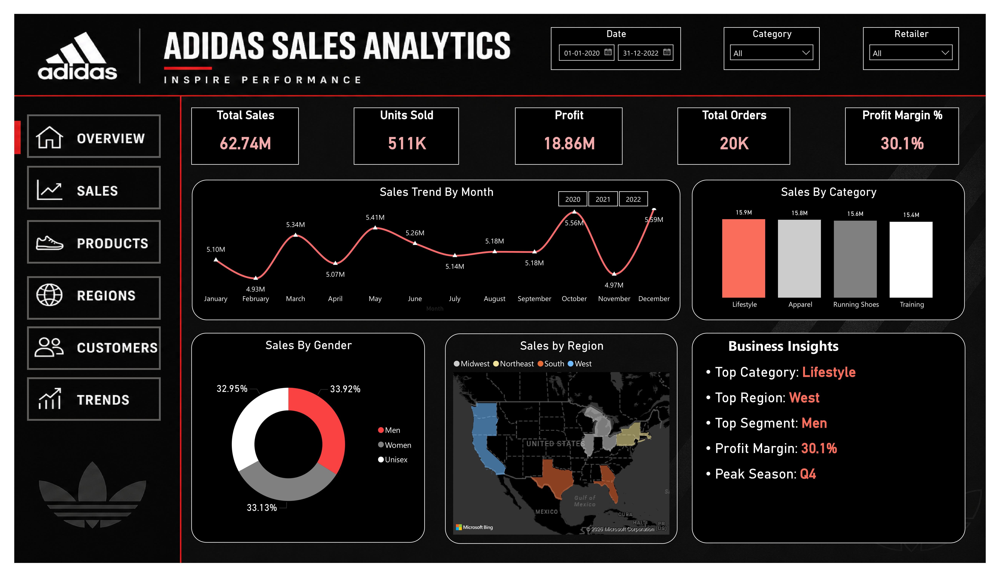
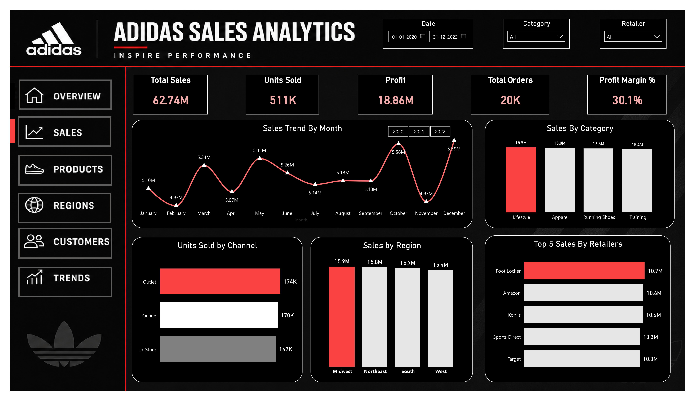
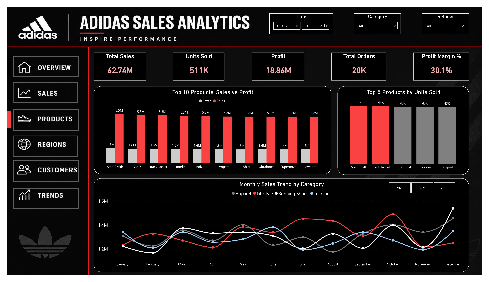
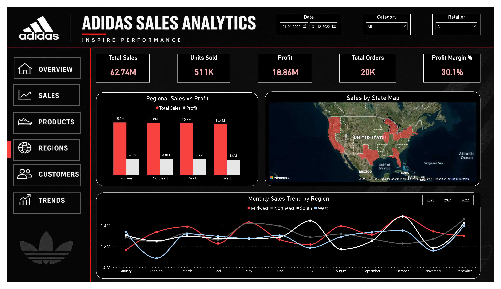
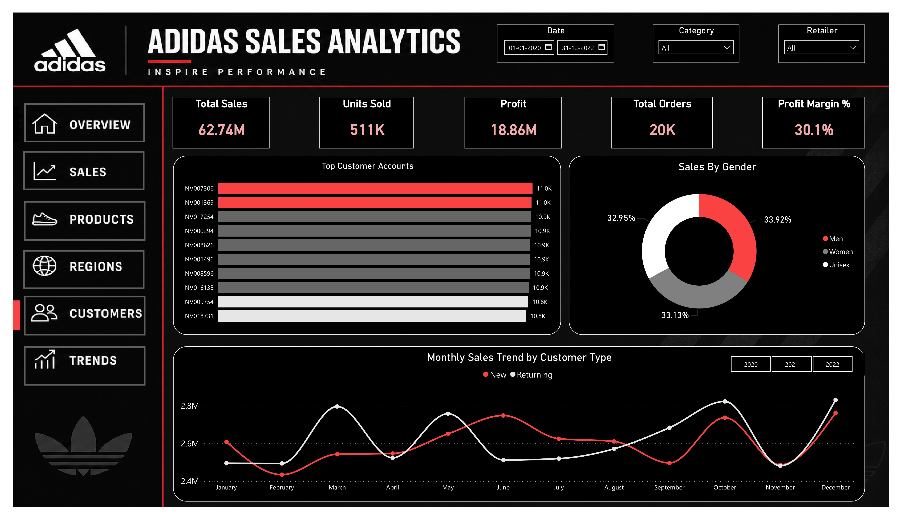
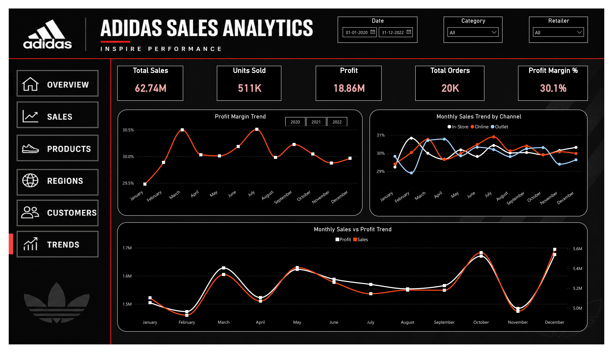

# 📊 Adidas Sales Analytics Dashboard | Power BI

## 📌 Project Overview

This project presents an interactive **Adidas Sales Analytics Dashboard** built using **Power BI** to analyze sales performance, profitability, customer behavior, product performance, regional trends, and business growth.

The dashboard enables users to explore key business metrics through interactive filters, dynamic visualizations, and multi-page reporting, supporting data-driven decision-making.

---

## 🎯 Objectives

- Monitor overall business performance
- Analyze sales and profit trends
- Identify top-performing products
- Evaluate regional sales performance
- Understand customer behavior
- Track profitability and growth trends
- Support data-driven decision-making

---

## 📂 Dashboard Pages

### 1️⃣ Overview Dashboard

Provides a high-level summary of business performance through KPI cards and executive insights.

**Key Metrics**
- Total Sales
- Operating Profit
- Units Sold
- Orders
- Profit Margin

---

### 2️⃣ Sales Analysis

Analyzes sales performance across:

- Product Categories
- Sales Channels
- Retailers
- Regions
- Monthly Sales Trends

---

### 3️⃣ Product Analysis

Provides insights into:

- Top Products by Sales & Profit
- Best-Selling Products
- Category Performance
- Monthly Sales Trends by Category

---

### 4️⃣ Regional Analysis

Analyzes:

- Sales vs Profit by Region
- Geographic Sales Distribution
- Regional Sales Trends

---

### 5️⃣ Customer Analysis

Explores:

- Top Customer Accounts
- Sales by Gender
- New vs Returning Customers
- Customer Sales Trends

---

### 6️⃣ Trend Analysis

Tracks business growth through:

- Profit Margin Trends
- Sales Channel Trends
- Monthly Sales & Profit Performance

---

## 🛠️ Tools & Technologies

- Power BI
- Power Query
- DAX
- Data Modeling
- Data Visualization

---

## 💡 Skills Demonstrated

### Data Analysis
- KPI Development
- Business Performance Analysis
- Trend Analysis
- Customer Segmentation

### Power BI
- Interactive Dashboards
- Bookmarks & Navigation
- Dynamic Slicers
- Data Modeling
- DAX Measures
- Visual Design

### Business Intelligence
- Sales Analytics
- Product Performance Analysis
- Regional Analysis
- Customer Insights
- Profitability Analysis

---

## 📈 Key Insights

- Generated insights from **$62.74M** in total sales.
- Identified top-performing products and retailers.
- Analyzed regional sales distribution across the United States.
- Evaluated customer purchasing behavior and retention trends.
- Monitored profitability through profit margin analysis.
- Compared sales performance across multiple sales channels.

---

## 📷 Dashboard Preview

### Overview Dashboard


### Sales Dashboard


### Products Dashboard


### Regions Dashboard


### Customers Dashboard


### Trends Dashboard

---

## 📁 Repository Structure

```text
Adidas-Sales-Analytics-Dashboard/
│
├── Dashboard/
│   └── Adidas_Sales_Analysis_Dashboard.pbix
│
├── Images/
│   ├── Overview.png
│   ├── Sales.png
│   ├── Products.png
│   ├── Regions.png
│   ├── Customers.png
│   └── Trends.png
│
└── README.md
```

---

## 🚀 Future Enhancements

- Drill-through analysis pages
- Advanced tooltip pages
- Forecasting and predictive analytics
- Mobile-optimized dashboard view

---

## 👨‍💻 Author

**Sanjay P Nambiar**

If you found this project useful, feel free to ⭐ the repository and connect with me on LinkedIn.
